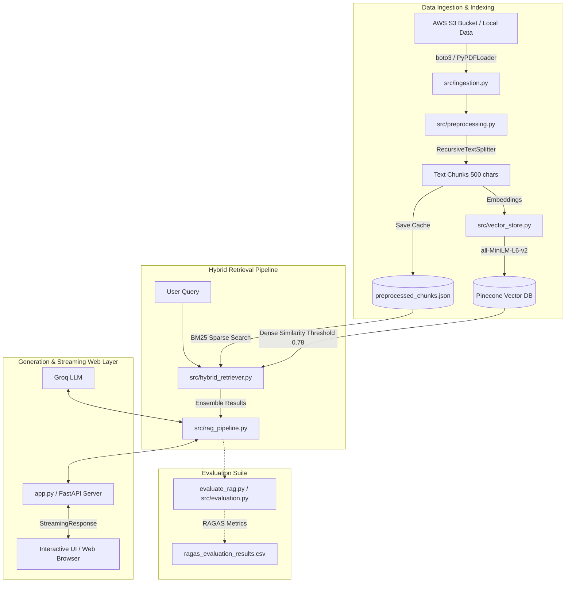

# 🩺 Medical Chatbot — Modular Hybrid RAG Pipeline with Interactive UI & RAGAS Evaluation

An end-to-end, production-ready **Medical AI Assistant** built with a modular Retrieval-Augmented Generation (RAG) architecture. The system indexes medical domain knowledge (such as the *Gale Encyclopedia of Medicine*), leveraging **Pinecone dense vector search**, **local BM25 sparse keyword retrieval**, **Groq LLM inference**, **FastAPI real-time streaming**, and continuous quality evaluation via the **RAGAS framework**.

> **Branch Note**: You are currently on the `ui_and_hybrid_search` branch, which implements **Hybrid Retrieval (Dense + Sparse)**, **Out-of-Domain Threshold Guardrails**, **FastAPI Real-Time Streaming Response**, and the **Interactive Web UI**.

---

## 🌟 Key Features

- **🔀 Hybrid Search (Dense + Sparse)**: Combines dense semantic embeddings (`sentence-transformers/all-MiniLM-L6-v2`) with sparse keyword matching (`BM25Retriever`) via an `EnsembleRetriever` with balanced 50/50 weighting.
- **🎯 Dynamic Out-of-Domain Filtering**: Implements a custom `HybridThresholdRetriever` that enforces a similarity score threshold (`0.78`) on dense Pinecone retrieval to safely reject out-of-domain medical queries.
- **📡 Real-Time Token & Context Streaming**: FastAPI backend featuring `StreamingResponse` to stream live generated answer tokens (`[ANSWER]`) and retrieved source context metadata (`[CONTEXT]`).
- **🖥️ Modern Web Interface**: Custom web frontend (`templates/chat.html`, `static/style.css`, `static/script.js`) with smooth auto-scroll, real-time message streaming, and source context drawer.
- **☁️ Automated Cloud Ingestion**: Integrates AWS S3 file loading via `boto3` with seamless local fallback (`Data/Medical_book.pdf`).
- **📊 RAGAS Quality Evaluation**: Production evaluation suite measuring **Faithfulness**, **Answer Relevancy**, **Context Precision**, and **Context Recall** with built-in `InMemoryRateLimiter` for free/on-demand LLM tiers.

---

## 🛠️ System Architecture



---

## 📂 Project Directory Structure

```text
.
├── Data/                             # Local raw PDF storage directory
│   └── Medical_book.pdf              # Source medical textbook
├── evaluation/                       # RAGAS evaluation suite & benchmarks
│   ├── RAGAS_DATASET_README.md       # Dataset metadata & specifications
│   ├── preprocessed_chunks.json      # Cached chunks for local BM25 index
│   ├── ragas_evaluation_results.csv  # Output metrics CSV report
│   ├── ragas_medical_evaluation_dataset.csv
│   └── ragas_medical_evaluation_dataset.json
├── research/                         # Jupyter notebook experiments & trials
│   └── trials.ipynb
├── src/                              # Core modular Python packages
│   ├── __init__.py
│   ├── evaluation.py                 # RAGAS metric executor with rate limiting & LLM binding
│   ├── exception.py                  # Custom exception handling with line tracing
│   ├── hybrid_retriever.py           # HybridThresholdRetriever (Dense threshold + BM25 Ensemble)
│   ├── ingestion.py                  # AWS S3 downloader & PDF DirectoryLoader
│   ├── logger.py                     # Centralized logging setup
│   ├── preprocessing.py              # Minimal metadata filtering & character chunking
│   ├── prompt.py                     # System prompt templates
│   ├── rag_pipeline.py               # RAG chain construction (ChatGroq + ChatPromptTemplate)
│   └── vector_store.py               # Pinecone index management & HuggingFace embeddings
├── static/                           # UI assets
│   ├── app.png                       # Application screenshot
│   ├── script.js                     # Async JS frontend logic (streaming, markdown, context drawer)
│   └── style.css                     # Modern dark theme styles
├── templates/                        # Frontend HTML templates
│   └── chat.html                     # Main interactive chatbot web interface
├── app.py                            # FastAPI application server & streaming endpoints
├── evaluate_rag.py                   # Orchestration script to run RAGAS benchmark evaluation
├── requirements.txt                  # Python dependencies declaration
├── setup.py                          # Package installation configuration
└── store_index.py                    # Data ingestion & indexing entry point script
```

---

## 💻 Tech Stack

- **Framework**: LangChain `v0.3+`, FastAPI, Uvicorn, Pydantic, Jinja2.
- **LLM Provider**: Groq API (`openai/gpt-oss-120b` / `llama-3.3-70b-versatile`).
- **Vector Database**: Pinecone (`serverless`, cosine distance, 384 dimensions).
- **Embeddings**: HuggingFace `sentence-transformers/all-MiniLM-L6-v2`.
- **Sparse Retrieval**: `rank_bm25` (`BM25Retriever`).
- **Evaluation**: RAGAS Framework (`faithfulness`, `answer_relevancy`, `context_precision`, `context_recall`).
- **Cloud Storage**: AWS S3 (`boto3`).

---

## ⚙️ Setup & Installation

### 1. Prerequisites
- Python 3.10+
- Pinecone API Key ([pinecone.io](https://www.pinecone.io/))
- Groq API Key ([console.groq.com](https://console.groq.com/))
- AWS S3 Bucket Credentials *(Optional: falls back to local `Data/` folder)*

### 2. Clone & Install Dependencies
```bash
git clone https://github.com/arup04/Medical-Chatbot-Project.git
cd Medical-Chatbot-Project

# Switch to the UI and Hybrid Search branch
git checkout ui_and_hybrid_search

# Create and activate virtual environment
python -m venv venv
source venv/bin/activate  # On Windows: venv\Scripts\activate

# Install required packages
pip install -r requirements.txt
```

### 3. Environment Variables
Create a `.env` file in the root directory:
```env
# Required API Keys
PINECONE_API_KEY="your-pinecone-api-key"
GROQ_API_KEY="your-groq-api-key"

# LLM Model Configuration (Optional)
GROQ_MODEL_NAME="openai/gpt-oss-120b"

# AWS S3 Storage Configuration (Optional)
AWS_ACCESS_KEY_ID="your-aws-access-key-id"
AWS_SECRET_ACCESS_KEY="your-aws-secret-key"
AWS_DEFAULT_REGION="us-east-1"
AWS_BUCKET_NAME="your-s3-bucket-name"
AWS_FILE_KEY="Medical_book.pdf"
```

---

## 🚀 Running the Pipeline

### Step 1: Document Ingestion & Indexing
Run `store_index.py` to load the PDF from S3/local data folder, chunk the text, cache chunks locally for BM25, and index vectors in Pinecone:
```bash
python store_index.py
```
> **Note**: If vectors already exist in Pinecone, ingestion is skipped to optimize API usage and execution time.

### Step 2: Run RAGAS Benchmark Evaluation
Evaluate pipeline generation and retrieval quality against evaluation datasets:
```bash
python evaluate_rag.py
```

### Step 3: Run the Web Application
Launch the FastAPI Web Application:
```bash
python app.py
```
Or run directly via Uvicorn:
```bash
uvicorn app:app --host 0.0.0.0 --port 8080 --reload
```
Open **`http://localhost:8080`** in your browser to chat with MediAid AI.

---

## 📊 RAGAS Evaluation Baseline Scores

Baseline evaluation scores for the Hybrid Search pipeline:

| Metric | Score | Target | Status | Description |
|---|---|---|---|---|
| **Faithfulness** | `0.8932` | > 0.80 | ✅ **Passed** | Measures factual consistency of answer against retrieved context. |
| **Answer Relevancy** | `0.9363` | > 0.80 | ✅ **Passed** | Quantifies how directly the answer addresses the user query. |
| **Context Precision** | `0.7778` | > 0.70 | ✅ **Passed** | Measures signal-to-noise ratio in retrieved documents. |
| **Context Recall** | `1.0000` | > 0.80 | ✅ **Passed** | Verifies retrieval of all relevant ground-truth facts. |

---

## 🔮 Future Roadmap

Upcoming feature branches in the pipeline:
1. **Re-ranking (`reranking_improvements`)**: Integrate FlashRank cross-encoder models to refine context relevancy.
2. **Conversational Memory (`conversational_memory`)**: Implement multi-turn chat history state management using SQLAlchemy and SQLite/PostgreSQL persistence.

---

## 📜 License & Author

Distributed under the MIT License. See `LICENSE` for details.

- **Author**: Arup Das
- **Repository**: [arup04/Medical-Chatbot-Project](https://github.com/arup04/Medical-Chatbot-Project)