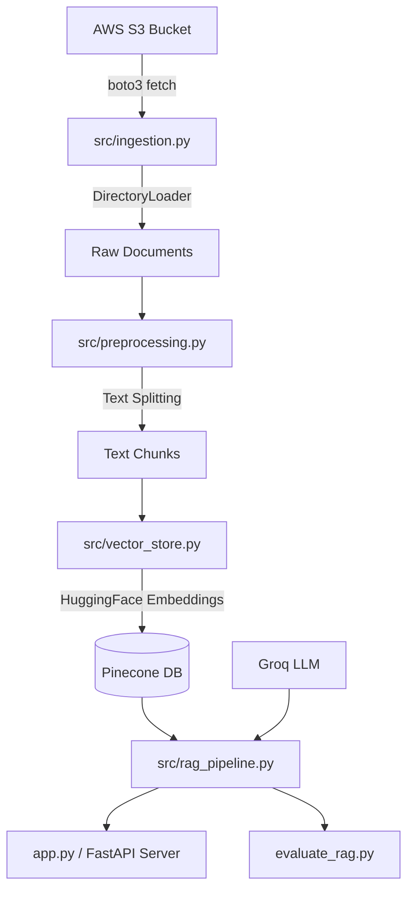

# Medical Chatbot Project — End-to-End Modular RAG Pipeline with RAGAS Evaluation

An end-to-end production-ready Medical Chatbot built with a modular Retrieval-Augmented Generation (RAG) architecture. This system indexes the *Gale Encyclopedia of Medicine* using Pinecone vector database, supports dynamic document loading from AWS S3, generates precise medical responses using Groq LLM, and evaluates system performance via RAGAS metrics.

---

## 🛠️ Architecture Overview

The system is structured as a decoupled, multi-stage RAG pipeline to ensure maintainability, scalability, and ease of deployment:



---

## 📂 Project Directory Structure

```text
├── evaluation/              # Test Q&A dataset and evaluation reports
│   ├── RAGAS_DATASET_README.md
│   ├── ragas_medical_evaluation_dataset.json
│   └── ragas_evaluation_results.csv
├── research/                # Jupyter notebook experimentation
│   └── trials.ipynb
├── src/                     # Core Python modular pipeline packages
│   ├── __init__.py
│   ├── ingestion.py         # AWS S3 file downloader & PDF Loader
│   ├── preprocessing.py     # Document text chunking & parsing
│   ├── vector_store.py      # Pinecone initialization & HuggingFace indexing
│   ├── rag_pipeline.py      # ChatGroq LLM chain assembly
│   ├── evaluation.py        # RAGAS metrics executor with rate limiting
│   ├── prompt.py            # System instructions and prompt templates
│   ├── logger.py            # Global logging configuration
│   └── exception.py         # Custom exception handling
├── static/                  # Frontend styling & images
├── templates/               # UI HTML files
├── app.py                   # FastAPI server entry point
├── store_index.py           # Pipeline entry point to build/sync index
└── evaluate_rag.py          # Pipeline entry point to run RAGAS evaluation
```

---

## 🚀 Setup & Installation

### 1. Prerequisites
- Python 3.10+
- Pinecone API Key
- Groq API Key
- AWS S3 Access (Optional, falls back to local data folder)

### 2. Install Dependencies
```bash
pip install -r requirements.txt
```

### 3. Configure Environment Variables
Create a `.env` file in the root directory:
```env
PINECONE_API_KEY="your-pinecone-api-key"
GROQ_API_KEY="your-groq-api-key"

# AWS Configuration (Optional)
AWS_ACCESS_KEY_ID="your-aws-access-key-id"
AWS_SECRET_ACCESS_KEY="your-aws-secret-key"
AWS_DEFAULT_REGION="us-east-1"
AWS_BUCKET_NAME="your-s3-bucket-name"
AWS_FILE_KEY="Medical_book.pdf"
```

---

## ⚡ Running the Pipeline

### Step 1: Ingest and Index Documents
Run `store_index.py` to fetch the source PDF from S3 (or load it from your local `Data/` folder), chunk the text, compute embeddings, and build/connect the Pinecone database.
```bash
python store_index.py
```
> [!NOTE]
> The indexer automatically checks if the vectors are already present in your Pinecone index, skipping upload if they are already populated to prevent unnecessary write operations and API usage.

### Step 2: Run RAGAS Evaluation
Evaluate the chatbot's generation quality (Faithfulness, Answer Relevancy) and retrieval quality (Context Precision, Context Recall):
```bash
python evaluate_rag.py
```
> [!IMPORTANT]
> The evaluation setup uses an `InMemoryRateLimiter` to gracefully space out requests (1 call every ~12s) to avoid 429 Rate Limit errors on Groq free/on-demand tiers.

### Step 3: Run the Chatbot Application
Start the FastAPI server:
```bash
python app.py
```
Open `http://localhost:8000` in your browser to chat with the bot.

---

## 📊 RAGAS Baseline Scores

Evaluating the modular pipeline against the Gale Encyclopedia test dataset yields the following scores:

| Metric | Score | Target | Status |
|---|---|---|---|
| **Faithfulness** | `0.8932` | > 0.80 | **Passed** |
| **Answer Relevancy** | `0.9363` | > 0.80 | **Passed** |
| **Context Precision** | `0.7778` | > 0.70 | **Passed** |
| **Context Recall** | `1.0000` | > 0.80 | **Passed** |

---

## 🔮 Future Roadmap (Advanced Features)

We will sequentially integrate the following features to scale the pipeline:
1. **Hybrid Search (Sparse + Dense):** Combine dense embeddings with sparse BM25 vectors inside Pinecone for both keyword matching and semantic searches.
2. **Re-ranking:** Integrate a Cross-Encoder model (e.g., Cohere or BGE-Reranker) to refine context relevance and boost Context Precision.
3. **Conversational Memory:** Enable multi-turn chat interaction by tracking stateful session history using LangChain history-aware chains.